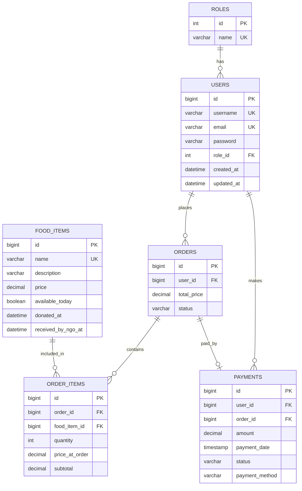

# Smart Canteen Backend - Phase 1 Database Layer

## 1. Database Configuration

Source files:

- `docker-compose.yml`
- `smart-canteen-backend/src/main/resources/application.properties`
- JPA entity classes under `smart-canteen-backend/src/main/java/com/smartcanteen`

Database details:

| Item | Value |
|---|---|
| Database engine | MySQL |
| Docker image | `mysql:8.0` |
| Database name | `smart_canteen_db` |
| Container hostname used by backend | `mysql` |
| Internal MySQL port | `3306` |
| Host mapped port | `3307` |
| Username | `root` |
| Password | `root` |
| JDBC URL | `jdbc:mysql://mysql:3306/smart_canteen_db?useSSL=false&serverTimezone=UTC&createDatabaseIfNotExist=true&allowPublicKeyRetrieval=true` |
| Hibernate dialect | `org.hibernate.dialect.MySQL8Dialect` |
| Schema generation | `spring.jpa.hibernate.ddl-auto=update` |

Important observation: there are no Flyway/Liquibase migrations or `schema.sql`/`data.sql` files in the backend. The database schema is generated/updated from JPA entity mappings at application startup.

## 2. Tables Identified

The backend defines six main database tables:

| Table | Source entity | Purpose |
|---|---|---|
| `roles` | `security.Role` | Stores user roles such as student, admin, canteen manager, and NGO |
| `users` | `security.User` | Stores registered application users |
| `food_items` | `model.Fooditem` | Stores canteen food items and donation/NGO receipt timestamps |
| `orders` | `model.Order` | Stores user orders and their total/status |
| `order_items` | `model.OrderItem` | Stores individual food items inside an order |
| `payments` | `model.Payment` | Stores payment record for an order |

## 3. Table Documentation

### `roles`

Purpose: master table for application roles.

| Column | Java type | Expected DB type | Constraints |
|---|---|---|---|
| `id` | `Integer` | `INT` | Primary key, auto increment |
| `name` | `ERole` enum | `VARCHAR(50)` | Not null, unique |

Allowed values:

- `ROLE_STUDENT`
- `ROLE_CANTEEN_MANAGER`
- `ROLE_ADMIN`
- `ROLE_NGO`

Seed behavior: `DataInitializer` inserts these roles on startup if they do not already exist.

### `users`

Purpose: stores authenticated users and links each user to one role.

| Column | Java type | Expected DB type | Constraints |
|---|---|---|---|
| `id` | `Long` | `BIGINT` | Primary key, auto increment |
| `username` | `String` | `VARCHAR(50)` | Not null, unique |
| `email` | `String` | `VARCHAR(100)` | Not null, unique |
| `password` | `String` | `VARCHAR(255)` | Not null |
| `role_id` | `Integer` | `INT` | Not null, foreign key to `roles.id` |
| `created_at` | `LocalDateTime` | `DATETIME(6)` | Not null, set by Hibernate `@CreationTimestamp`, not updatable |
| `updated_at` | `LocalDateTime` | `DATETIME(6)` | Not null, set by Hibernate `@UpdateTimestamp` |

Relationships:

- Many users belong to one role.
- One user can have many orders.
- One user can have many payments.

### `food_items`

Purpose: stores food/menu items and tracks donated/NGO-received food timestamps.

| Column | Java type | Expected DB type | Constraints |
|---|---|---|---|
| `id` | `Long` | `BIGINT` | Primary key, auto increment |
| `name` | `String` | `VARCHAR(255)` | Not null, unique |
| `description` | `String` | `VARCHAR(255)` | Nullable |
| `price` | `BigDecimal` | `DECIMAL(38,2)` by Hibernate default | Not null |
| `available_today` | `boolean` | `BIT` / `BOOLEAN` | Not null, default Java value `true` |
| `donated_at` | `LocalDateTime` | `DATETIME(6)` | Nullable |
| `received_by_ngo_at` | `LocalDateTime` | `DATETIME(6)` | Nullable |

Relationships:

- One food item can appear in many order items.

### `orders`

Purpose: stores order header information for a user.

| Column | Java type | Expected DB type | Constraints |
|---|---|---|---|
| `id` | `Long` | `BIGINT` | Primary key, auto increment |
| `user_id` | `Long` | `BIGINT` | Not null, foreign key to `users.id` |
| `total_price` | `BigDecimal` | `DECIMAL(10,2)` | Not null |
| `status` | `EOrderStatus` enum | `VARCHAR(20)` | Not null |

Allowed `status` values:

- `PENDING`
- `PREPARING`
- `READY_FOR_PICKUP`
- `PICKED_UP`
- `CANCELLED`

Relationships:

- Many orders belong to one user.
- One order has many order items.
- One order can have one payment.

Note: older timestamp fields for `order_date` are commented out in the entity and are not part of the current JPA model.

### `order_items`

Purpose: stores line items for an order.

| Column | Java type | Expected DB type | Constraints |
|---|---|---|---|
| `id` | `Long` | `BIGINT` | Primary key, auto increment |
| `order_id` | `Long` | `BIGINT` | Not null, foreign key to `orders.id` |
| `food_item_id` | `Long` | `BIGINT` | Not null, foreign key to `food_items.id` |
| `quantity` | `Integer` | `INT` | Not null |
| `price_at_order` | `BigDecimal` | `DECIMAL(10,2)` | Not null |
| `subtotal` | `BigDecimal` | `DECIMAL(10,2)` | Not null |

Relationships:

- Many order items belong to one order.
- Many order items can reference one food item.

### `payments`

Purpose: stores payment details for an order.

| Column | Java type | Expected DB type | Constraints |
|---|---|---|---|
| `id` | `Long` | `BIGINT` | Primary key, auto increment |
| `user_id` | `Long` | `BIGINT` | Not null, foreign key to `users.id` |
| `order_id` | `Long` | `BIGINT` | Not null, unique, foreign key to `orders.id` |
| `amount` | `BigDecimal` | `DECIMAL(10,2)` | Not null |
| `payment_date` | `LocalDateTime` | `TIMESTAMP` | Not null, default current timestamp, not updatable |
| `status` | `EPaymentStatus` enum | `VARCHAR(20)` | Not null |
| `payment_method` | `String` | `VARCHAR(50)` | Not null |

Allowed `status` values:

- `PENDING`
- `COMPLETED`
- `FAILED`
- `REFUNDED`
- `CANCELLED`

Relationships:

- Many payments belong to one user.
- One payment belongs to one order.
- `payments.order_id` is unique, so an order can have at most one payment.

## 4. Relationship Summary

| Relationship | Type | Implemented by |
|---|---|---|
| `roles` to `users` | One-to-many | `users.role_id -> roles.id` |
| `users` to `orders` | One-to-many | `orders.user_id -> users.id` |
| `users` to `payments` | One-to-many | `payments.user_id -> users.id` |
| `orders` to `order_items` | One-to-many | `order_items.order_id -> orders.id` |
| `food_items` to `order_items` | One-to-many | `order_items.food_item_id -> food_items.id` |
| `orders` to `payments` | One-to-one | `payments.order_id -> orders.id`, unique |

## 5. ER Diagram

## 6. Reverse Engineering Notes

- The schema is code-first, not migration-first.
- Hibernate will update the database based on current entity definitions.
- Actual MySQL column definitions may vary slightly where no explicit `@Column` length/precision is provided.
- Because `ddl-auto=update` does not clean up old columns automatically, an existing database may still contain columns from older versions of entities, such as a previously used `order_date`.
- To confirm the physical database exactly, run `SHOW CREATE TABLE <table_name>;` against the live MySQL container.

